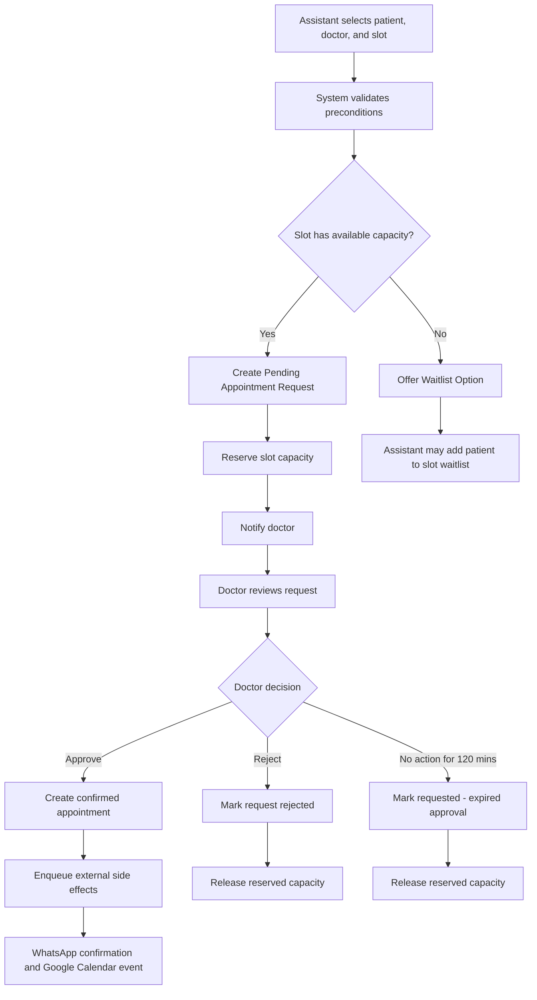

# Workflow: Appointment Request
## Status
Draft v1.0

## Purpose
The appointment request workflow allows an assistant to request a specific appointment slot on behalf of a patient while keeping the final scheduling decision with the doctor. This workflow is used for normal clinic scheduling where the assistant coordinates availability, the doctor approves or rejects the proposed booking, and the patient is informed only after the appointment is confirmed.

An appointment request is not a confirmed appointment. It is a proposed booking that temporarily reserves slot capacity while waiting for doctor action.

## Business Context
In the target clinic workflow, assistants are responsible for coordinating patient availability, doctor availability, and operational context. Doctors remain responsible for approving whether a patient should be booked into their time. The system should support this real-world division of responsibility without forcing rigid automation.

The assistant initiates the request. The doctor decides. The system records the state, prevents accidental overbooking beyond configured limits, and ensures that external communication only happens after the internal state is valid.

## Actors
Primary actor: Assistant.
Secondary actor: Doctor.
Referenced entities: Patient, Doctor, Availability Slot, Appointment Request, Appointment, Clinic Settings, Notification, Waitlist Entry.

## Workflow Diagram

## Preconditions
Before an appointment request can be created, the patient must exist or be created during the flow, the doctor must exist, the doctor must be active, the selected slot must belong to the selected doctor, and the selected slot must be valid for scheduling. If the slot is currently full, the assistant may not create a direct pending request, but may add the patient to that slot's waitlist.

The workflow must check the clinic-level setting `Allow Multiple Bookings Per Slot`. If the setting is disabled, the slot capacity is one. If the setting is enabled, the slot capacity is three. Pending requests and confirmed appointments both count toward slot capacity. Waitlisted patients do not count toward slot capacity.

## Request Creation
The assistant creates an appointment request by selecting the patient, doctor, date, and slot. The assistant may also enter chief complaint, medical history, referral source, age, phone number, and scheduling notes. The request is created only after the system validates that the slot has available capacity or that the assistant has chosen the waitlist path instead.

When the request is successfully created, the request status becomes `Pending`, the slot capacity is reserved, the request creator is recorded, and the assigned doctor is notified. The patient is not notified at this stage.

## Patient Communication During Pending State
The patient must not receive appointment confirmation while the request is pending. A pending request is not an appointment. The product must avoid creating the impression that a patient has a confirmed booking before the doctor approves it.

## Doctor Approval Screen
When the doctor opens a pending request, the default screen should show only the information needed to make the approval decision. The doctor should see patient name, requested time slot, age, chief complaint, and notes. The doctor should have a `View Patient History` action to inspect last visits and previous treatment context, but patient history should not be forced into the default approval view.

The approval screen may expose a phone number and call action if the platform allows direct linking to the phone app. The system should not prevent doctors from contacting patients directly when needed.

## Editable Fields
Pending appointment requests are editable by assistants. The assistant may edit chief complaint, medical history, notes, referral source, age, phone number, and patient metadata. These edits do not change the identity of the request and do not require creating a new request.

The assigned doctor should not receive a push notification or WhatsApp message for every edit. Instead, when the doctor opens the request, the doctor should see that the request was modified after creation and should be able to inspect the change history.

Example display: `This request was modified after creation. View changes.`

The change history should show who edited the request, when it was edited, which field changed, the previous value, and the new value.

## Non-Editable Fields
The doctor, date, and time slot may not be changed on an existing pending request. Changing any of these creates a different scheduling request because it changes ownership, capacity, approval context, and notification routing.

If the assistant needs to change doctor, date, or slot, the assistant must cancel the existing request and create a new request. The old request remains historical.

## Existing Future Appointment Warning
When the assistant creates a request for a patient who already has future appointments, the system should warn the assistant but not block the workflow. Future appointments include pending and confirmed appointments. Completed, cancelled, rejected, expired, and no-show appointments do not count for this warning.

The warning should show existing future appointments with doctor, date, time, and status.

The assistant should be offered three actions: `Confirm and Proceed`, `Check Appointment History`, and `Cancel Existing Appointment and Schedule New`.

If the assistant chooses `Confirm and Proceed`, the new request is created without modifying existing appointments. If the assistant chooses `Check Appointment History`, the patient's appointment history opens for review. If the assistant chooses `Cancel Existing Appointment and Schedule New`, the system starts a rescheduling workflow and must not cancel the existing appointment until the replacement appointment is successfully approved.

## Safe Rescheduling Rule
The system must preserve an existing confirmed appointment until a replacement has been approved. The product should never destroy a valid appointment before another confirmed appointment exists.

If a replacement request is rejected, cancelled, or expires, the original appointment remains unchanged.

## Request Cancellation
Any assistant in the clinic may cancel a pending appointment request. Doctor approval is not required because the request has not yet become a confirmed appointment. When a pending request is cancelled, its status becomes `Cancelled`, reserved slot capacity is released immediately, and the doctor is informed that the request was cancelled.

Cancelled requests are terminal and cannot be reopened or approved later.

## Request Rejection
The doctor may reject a pending request. A rejection note is optional. Rejected requests are terminal and cannot be reopened. If the doctor later changes their mind, the assistant must create a new request.

A rejected request may be used as the starting point for a new request through a `Reschedule Request` action. This action must not reopen the rejected request. It should pre-populate patient and doctor context where appropriate and create a new request with a reference to the rejected request.

## Request Expiry
Appointment requests expire after 120 minutes if the doctor has not approved or rejected them. Once the expiry threshold is reached, the assistant screen should show the request as `Requested - Expired Approval`.

Expired requests release reserved slot capacity. Expired requests remain visible in history and on relevant screens but cannot be approved. If the doctor opens an expired notification, the request should be clearly marked as expired. The notification should not disappear because disappearing notifications create confusion.

Assistants should have a mechanism to re-trigger the approval notification workflow for expired or still-pending requests. Re-triggering approval notification should not create a new request unless the assistant explicitly chooses to create one. It should only resend or re-surface the approval request to the doctor.

## Waitlist Handling
If a slot is full, the assistant may add the patient to the waitlist for that specific doctor, date, and time slot. A waitlist entry is not a pending appointment request. It does not notify the doctor, does not reserve capacity, and does not notify the patient.

When capacity becomes available because a request is cancelled, rejected, or expired, or because an appointment is cancelled, the system should notify assistants that capacity is available and should surface the waitlist for that slot.

The system must never automatically promote a waitlisted patient into a pending request. The assistant decides whether to promote a waitlisted patient.

## Capacity Rules
Slot capacity is controlled by the clinic setting `Allow Multiple Bookings Per Slot`.

When disabled, a slot may contain only one pending request or confirmed appointment. When enabled, a slot may contain up to three pending requests and confirmed appointments combined.

Capacity is released immediately when a pending request becomes `Cancelled`, `Rejected`, or `Requested - Expired Approval`.

Capacity validation must be atomic. If two assistants attempt to reserve the last available capacity at the same time, only one request may succeed. The system must never allow occupancy to exceed configured capacity.

## Stale State Protection
Every state transition must verify the current state before committing. If the current state does not match the expected state, the operation must fail.

Example: if the doctor attempts to approve a request but the assistant has already cancelled it, approval must fail. No appointment should be created, no WhatsApp message should be sent, and no Google Calendar event should be created.

## External Side Effects
External side effects must happen only after the internal appointment state has successfully changed. WhatsApp messages and Google Calendar operations must not fire during an attempted state transition.

The safe sequence is: validate transition, commit internal state change, enqueue side-effect event, process side-effect event asynchronously.

If appointment confirmation succeeds but WhatsApp delivery fails, the appointment remains confirmed. WhatsApp failure must create a visible assistant task or notification with an action to re-trigger WhatsApp confirmation. The appointment is the source of truth. WhatsApp is only a communication channel.

## Emergency And Manual Override Reference
The normal appointment request workflow is not the only way appointments enter the system. In emergency or after-hours situations, a doctor or assistant may create an appointment through a direct booking or retroactive entry workflow. These are separate workflows, but the appointment request workflow must not attempt to prevent real-world clinic behavior.

The product principle is that the system records reality and helps staff coordinate around it. It does not force patient care to wait for software workflow completion.

## Notifications
When a request is created, the doctor should receive an application notification and a WhatsApp notification. The WhatsApp notification should include a deep link to the request in the application. Approval and rejection actions occur inside the application.

When a request is cancelled by an assistant, the doctor should receive an informational notification. When request approval expires, the expired state should remain visible to the doctor and assistant. When capacity becomes available and waitlisted patients exist, assistants should be notified.

## Audit Events
The system should record request creation, request modification, notification re-triggering, request cancellation, request rejection, request expiry, waitlist addition, waitlist promotion, and failed stale-state transitions.

For each audit event, the system should record actor, timestamp, entity affected, previous state where applicable, new state where applicable, and relevant notes.

## Terminal States
The terminal states for an appointment request are `Approved`, `Rejected`, `Cancelled`, and `Requested - Expired Approval`. Terminal states cannot be reopened. Any future scheduling action must create a new request or appointment through the appropriate workflow.

## Open Questions
The current document intentionally leaves detailed doctor direct booking, retroactive appointment creation, appointment approval, appointment rejection, and appointment rescheduling to separate workflow documents. Those workflows should reference this document where they interact with request creation, request expiry, waitlists, capacity, or side effects.
